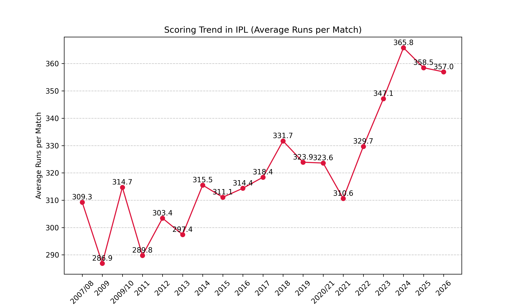
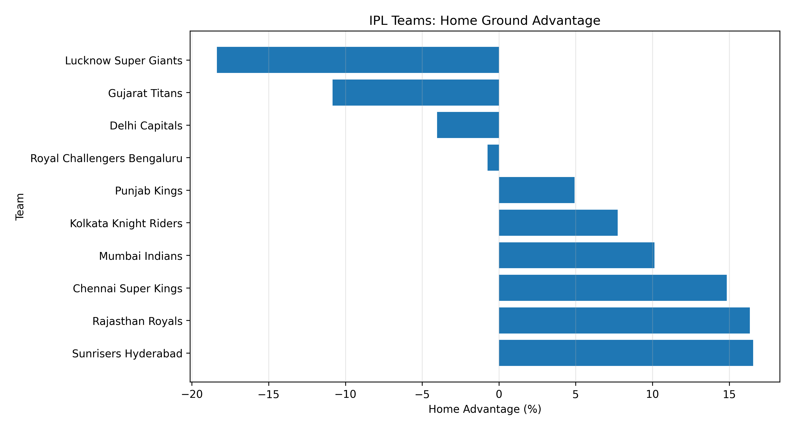
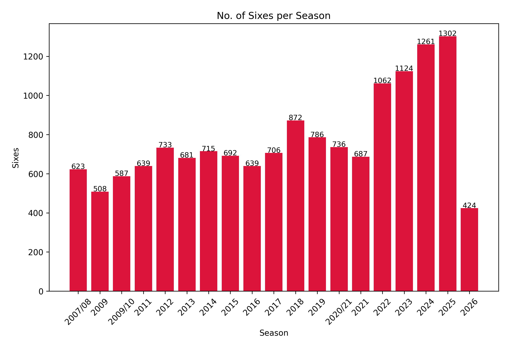
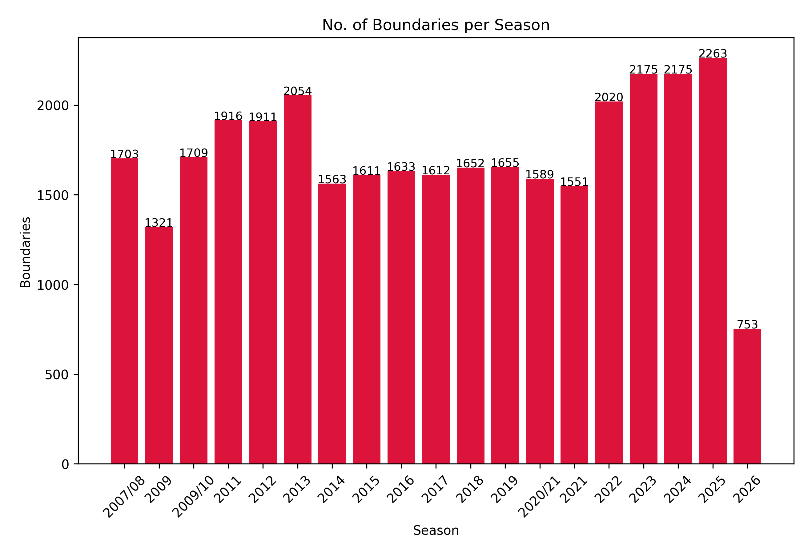

# IPL 2008–2025 Exploratory Data Analysis

## Project Overview

This project analyzes Indian Premier League (IPL) data from 2008 to 2025 using Python, Pandas, NumPy, and Matplotlib.

The objective is to identify trends in team performance, batting records, bowling records, venue statistics, scoring patterns, and match outcomes through exploratory data analysis (EDA).

---

## Sample Visualization



---

## Dataset

- [IPL data from 2008–2025](https://www.kaggle.com/datasets/chaitu20/ipl-dataset2008-2025)
- The Dataset contains incomplete information of 2026 - IGNORE THE 2026 DATA in the output wherever seen
- Approximately 200,000 rows and 65 columns
- Contains match-level and ball-by-ball information

---

## Technologies Used

- Python
- Pandas
- NumPy
- Matplotlib
- Jupyter Notebook

---

## Analysis Performed

### Season Analysis

- Matches played per season
- Average score per season
- Scoring trends over time

A shift from early 300s to mid‑350 average runs per match across IPL seasons highlights how the game has evolved

### Team Analysis

- Teams which have discontinued are not considered for analysis.
- Cumulative results of teams with renamed franchise are considered.

#### Most Successful Teams

- Mumbai Indians have won the highest number of matches in IPL history, reflecting their long-term consistency and multiple championship-winning campaigns.

#### Team win percentages

- GT has the highest win percentage among active IPL franchises in the dataset, showing remarkable consistency despite being a newer entrant.

#### Chasing performance

- GT leads IPL in chasing win percentage, showcasing efficiency under pressure, while CSK remains the most consistent chaser across seasons

#### Home-ground advantage

- CSK performs the best at homeGround with 66% wins but only 51% at other grounds.
- GT performs the best when away (65%) but only 54% wins at homeGround.
- Teams like DC, RCB, PKBS, KKR, and MI hover close to neutral, showing little difference between home and away performance. This indicates adaptability across venues.
  

### Batting Analysis

#### Top run scorers across all seasons

- Virat Kohli leads the list with over 9,000 runs, followed by Rohit Sharma.

#### Highest strike rates

- Strike rate measure how quickly a batter scores runs or how frequently a bowler takes wickets, reflecting efficiency and impact in a match
- The highest strike rate in IPL history is held by Vaibhav Sooryavanshi, with a remarkable strike rate of 230s.

#### Most sixes

- Chris Gayle tops the list with nearly 360 sixes across IPL seasons.

#### How has the sixers trend changed across seasons?



#### Most boundaries

- Virat Kohli has the most number of boundaries in IPL history till date

#### \* How has the boundaries trend changed across seasons?



#### Orange Cap winners

- The Orange Cap is awarded to the highest run scorer of a season.

### Bowling Analysis

#### Most wickets

- YS Chahal is the highest wicket-taker in IPL history with 233 wickets.

#### Best economy rates

### Match & Venue Analysis

- Highest-scoring stadiums
- Toss impact on match outcomes
  - Across IPL seasons, toss winners win only ~51% of matches, showing that while toss decisions offer a minor edge, match outcomes are still driven largely by team performance

---

## Key Findings

- Average runs per match increased from approximately 300 in the early IPL seasons to over 350 in recent seasons.
- Some franchises demonstrate a strong home-ground advantage.
- Winning the toss provides only a limited advantage.
- Batting strategies have become increasingly aggressive in recent seasons.

---

## Repository Structure

IPL-2008-2025-EDA/

├── IPL_Analysis.ipynb

├── README.md

└── images/

---

## Skills Demonstrated

- Data Cleaning and Preprocessing
- Exploratory Data Analysis (EDA)
- Data Visualization
- Statistical Aggregation using Pandas
- Trend Analysis
- Sports Analytics

## How to Run

1. Clone the repository
2. Install required libraries
3. Open the Jupyter Notebook
4. Run all cells

```bash
pip install pandas numpy matplotlib
jupyter notebook
```
